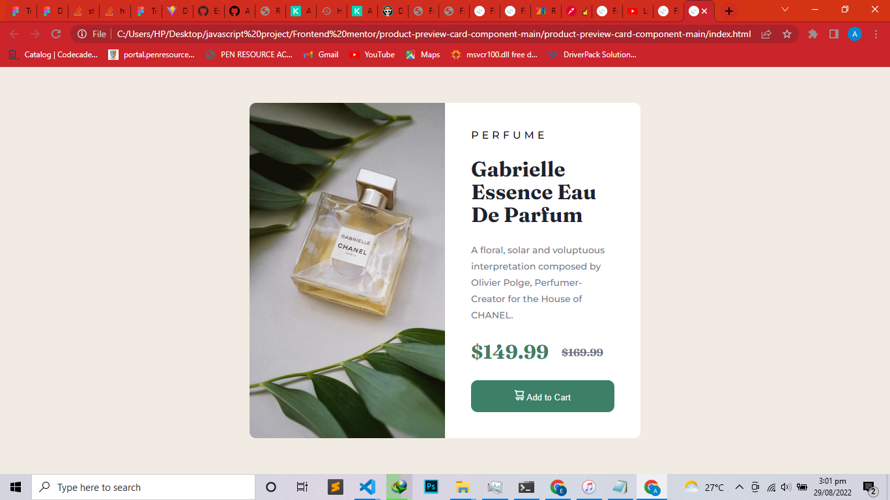

# Frontend Mentor - Product preview card component solution

This is a solution to the [Product preview card component challenge on Frontend Mentor](https://www.frontendmentor.io/challenges/product-preview-card-component-GO7UmttRfa). Frontend Mentor challenges help you improve your coding skills by building realistic projects. 

## Table of contents

- [Overview](#overview)
  - [The challenge](#the-challenge)
  - [Screenshot](#screenshot)
  - [Links](#links)
- [My process](#my-process)
  - [Built with](#built-with)
  - [What I learned](#what-i-learned)
  - [Continued development](#continued-development)
  - [Useful resources](#useful-resources)
- [Author](#author)

## Overview

### The challenge

Users should be able to:

- View the optimal layout depending on their device's screen size
- See hover and focus states for interactive elements

### Screenshot




### Links

- Solution URL: [Add solution URL here](https://your-solution-url.com)
- Live Site URL: [Add live site URL here](https://your-live-site-url.com)

## My process

### Built with

- Semantic HTML5 markup
- CSS custom properties
- Flexbox
- CSS Grid
- Mobile-first workflow

### What I learned

```css
@media (max-width:600px)
i learnt how to use media queries

```

### Continued development

I will focus more on javascript project

### Useful resources
- [Resource](https://www.w3schools.com) - This is an amazing website that helped me when i had problems remembering some css properties. I'd recommend it to anyone still learning this concept and anyone who need a quick recap on any concept.


## Author

- Github - [Esinnation](https://www.github.com/esinnation)
- Frontend Mentor - [@Esinnation](https://www.frontendmentor.io/profile/Esinnation)
- Twitter - [@Esinnation](https://www.twitter.com/esinnation)